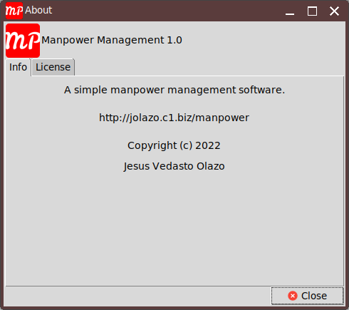
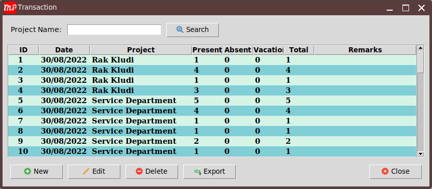

# Manpower Management 1.0.0
A simple manpower management software. It is used to track down manpower, print report for submission, and can export to excel too if needed.

## Motivation
I was using excel to track down and submit the report for manpower up until recently. The problem with excel files is that the more sheets you use the slower it become. If you decide to use diffirent excel files it will be difficult to track down old reports and quite difficult to search unlike this software you just need to select the date and the system itself will carry on the searching for you. Hence this software.

## Build Status
This software is now possible to use but some of the options are still under construction but most of the basic requirements are already met so using it in everyday will be okay. I was thinking of adding a dashboard option just to show how are the status of the manpower divided and been utilized for different projects.

## Coding Style
There is no particular coding style that has been used in this project just the basic stuffs.

## Screenshots

## Tech/Framework used

Below are the frameworks used in this software.

* Python 3.8
* Tkinter
* FPDF
* Pillow
* OpenPyXl
* Sqlite3
* Sqlalchemy

## Features

## Installation
There is no need to install the software. Place it where you are ussually saving your files for example in the **Desktop** folder. Database will be created under your user directory in **.manpower_mngt** folder just incase you needed to back it up for security purposes.

## Tests
To be honest, I don't know much about testing. Hence can't really add here the test I made as I do not have one. If one of you can teach me how to test graphical user interface testing feel free to contact me. I am open to anything.

## License
**MIT** License
